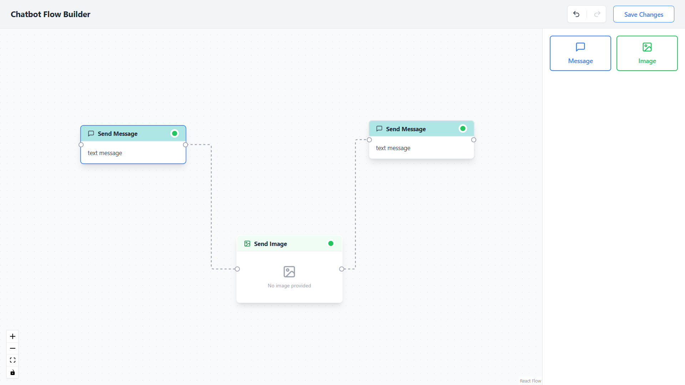
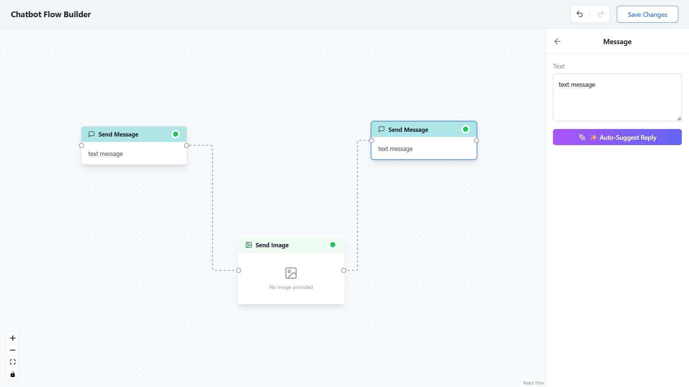
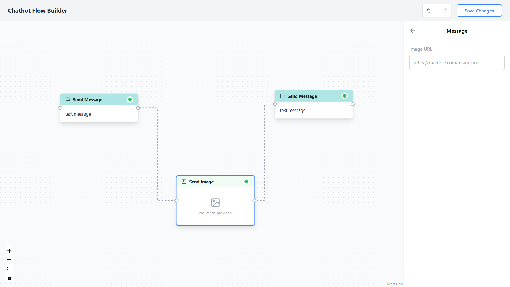

# React Flow Chatbot Builder 🤖✨

[](https://chatbot-flow-builder-gold.vercel.app/)
&nbsp;&nbsp;&nbsp;
[**👉 Try the Live Demo here! 🚀**](https://chatbot-flow-builder-gold.vercel.app/)

A premium, production-ready React application for building chatbot conversational flows. Built with **React Flow**, **Tailwind CSS**, and **Vite**.





## Features 🚀

### 1. Extensible Node Architecture
- **Drag-and-Drop Canvas:** Easily drag nodes from the Sidebar onto the interactive React Flow canvas.
- **Multiple Node Types:** Supports `TextNode` for standard messages and `ImageNode` for rich media. The architecture is designed to easily scale to support Delays, Conditions, and API triggers.
- **Dynamic Settings Panel:** The settings sidebar intelligently swaps its input fields based on the currently selected node type (Textarea for texts vs URL input for images). Automatically resolves Google Image links.

### 2. Robust Undo/Redo System ⏪
- Never lose your progress. Built-in time-travel state management wrappers tracking the React Flow `useNodesState`.
- **Keyboard Shortcuts:** Full support for `Ctrl+Z` (Undo) and `Ctrl+Y` / `Cmd+Shift+Z` (Redo).
- **Smart Snapshots:** Captures history on critical events (Node Drop, Edge Connect, Deletions) and utilizes Debouncing to prevent saving hundreds of snapshots during a typing burst.

### 3. Graph Validation (Cycle Detection) 🛡️
- Employs a **Depth-First Search (DFS)** algorithmic utility to validate the entire workflow graph on Save.
- **Infinite Loop Prevention:** Evaluates the Directed Graph to ensure a user hasn't connected a loop (e.g. A → B → C → A). If a cycle is detected, the save is blocked.
- **Orphan Node Prevention:** Ensures all nodes have a proper target connection.

### 4. Smart Node (AI Auto-Complete) ✨
- Select any Text Node on the canvas and click "**✨ Auto-Suggest Reply**". 
- The system traverses the graph backwards to read the parent node's context and generates a contextual AI response automatically to speed up flow generation.

### 5. Download Canvas as Image 📸
- **High-Quality Export**: Click the "**Export PNG**" button in the header to instantly generate a portable image of your flow.
- **Perfect Framing**: Uses `getNodesBounds` to precisely capture the entire graph, regardless of your current pan or zoom level.
- **Robust Rendering**: Employs the `html-to-image` engine targeting the native React Flow viewport to capture an exact, styled replica of the canvas with a solid background.

### 6. Premium UI/UX Polish 💅
- **Aesthetics:** Styled with modern consumer-grade visuals using Tailwind CSS. Soft dropshadows, distinct Node Headers, smooth border-radiuses.
- **Animated Edges:** Employs React Flow's `smoothstep` bezier curves with animated marching dashes to simulate data flow.
- **Interactive:** Hover states, drag indicators, and central empty-state overlays provide clear user cues.
- **Toasts:** Utilizes `react-hot-toast` for sleek, non-intrusive success and error notifications.

## Getting Started 💻

### Prerequisites
- Node.js (v18+)

### Installation
1. Clone the repository:
   ```bash
   git clone https://github.com/yourusername/chatbot-flow-builder.git
   cd chatbot-flow-builder
   ```

2. Install dependencies:
   ```bash
   npm install
   ```

3. Start the development server:
   ```bash
   npm run dev
   ```
   The app will be available at `http://localhost:5173`.

### Building for Production
```bash
npm run build
```
The optimized bundle will be generated in the `/dist` directory.

## Tech Stack 🛠️
- **React 18** (Vite Bootstrapped)
- **React Flow** (Core Drag & Drop Node Visualizer)
- **html-to-image** (DOM to PNG conversion)
- **Tailwind CSS** (Utility First Styling)
- **Lucide React** (Premium Iconography)
- **React Hot Toast** (Notifications)

## Project Structure 📁
```
src/
├── hooks/
│   └── useUndoRedo.js        // Advanced Undo/Redo history tracking
├── utils/
│   ├── graphValidation.js    // DFS Graph Cycle Detection 
│   ├── graphUtils.js         // Graph Traversal AI Helpers
│   ├── downloadImage.js      // Canvas Export Utility
│   └── aiService.js          // Mock LLM Endpoint
├── App.jsx                   // Main Application & Canvas Provider
├── Header.jsx                // Top bar, Save logic & Validation hooks
├── Sidebar.jsx               // Sidebar Router (Settings vs Nodes)
├── NodesPanel.jsx            // Draggable Node Repository
├── SettingsPanel.jsx         // Dynamic AI & Data Mutation Inputs
├── TextNode.jsx              // Custom Node Type: Message
├── ImageNode.jsx             // Custom Node Type: Media
└── index.css                 // CSS Injection & Base Styles
```
